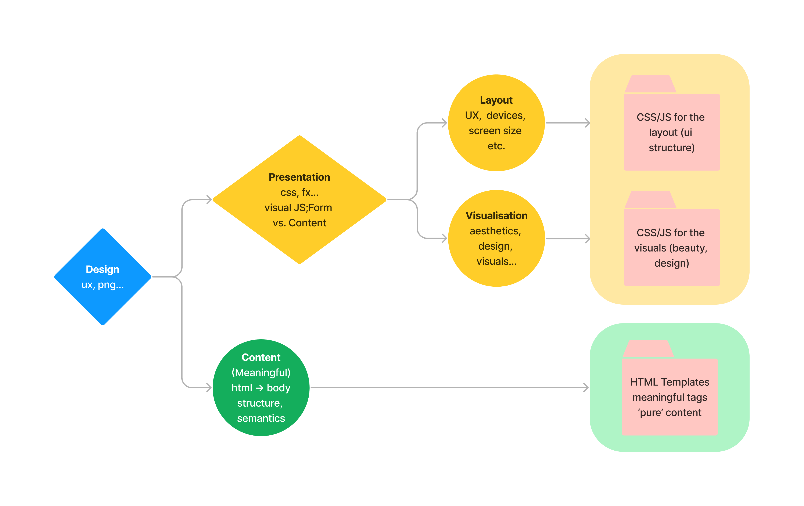
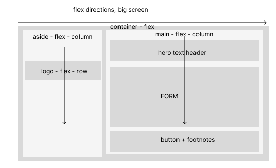
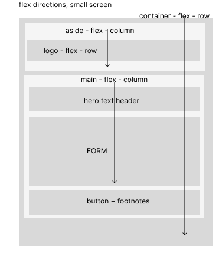

# odin-signup

# TOP assignment for contact form:
* non-responsive
* vanilla
* close to provided design

# Goal:
To practice css

# Live demo
https://vpchar.github.io/odin-signup/

# Initial Failure
I started on blank file and...after 2 hours deleted everything and went away. As many times before, I felt lost in this *css mess*. Did I say I hate(d) CSS? Anyway, if I want to become web dev, I have to learn to love this thing. So I got a break.

While drinking coffe outside, I decided to make a plan. The plan was about how to structure
the task and how to cut it in small pieces. 

Oh, yeah, I played this https://flexboxfroggy.com game while outside. That was also refreshing

# Keep it simple, stupid

I got back with the general idea to make some "workflow" model, in order to simpify the task.

Then I opened Figma (I am not a designer and don't want to be, but I feel we should at least have basic understanding of things like PS or Figma) to build this "workflow" diagram that I plan to use from now on for all such "cut-the-design" tasks in future:



With this as operative "algorythm" I opened the design png and started thinking what's content, what's layout and what's visuals only.  The vague idea was to focus on the layout first, then make it step by step, one container at a time.

# Plan for the beginning of the page
The first representation was this: 



Then I decided to ask for responsive behavior also: 



So I focused on the LAYOUT again and spent few minutes looking for solutions online, then built it. If you know what's happening, you kinda "see it". Still hate css but little less now...

I decided that if I split the css file in two -- one for the layout (skelethone) and one for the visual gimmics, things could be better (see above). Reinventing the weel here, I suppose, but separating things on smaller parts always helps me.

at this stage I had working responsive basic layout with this html:

```html
<body> 
    <!-- In our BODY, we put only content and structure -->
  <div class="container"> <!-- Wrapper for the form -->
    <aside> 
        <div class="logo">
            <!-- Logo and ODIN name are content, because branding, site structure etc.
            background image is not a content, so it goes to the css -->
             
            <div class="title"> ODIN </div>
        </div> 
    </aside>
    <main> 
        <!-- signup form itself, definitely content -->
    </main> 
  </div>  
  <!-- End of BODY -->
</body>
```

and this css:

```css
/* (1) CSS Layout Part  */
/* ============================================================ */

body{
    /* remove sidebar: */
    overflow: hidden; 
    width: 100vw;
    height: 100vh;
    margin:0;
    padding: 0;
}
.container{
    /* set the container to flex model */
    display: flex;
    height: 100%;
}
aside{
    flex: 1 0 30%;
    flex-direction: column;
    /* moving logo down */
    padding: 15% 0;
}
main{
    /* Return sidebar for the nested main container */
    overflow-y: auto;
    flex: 1 0 70%;
}

/* Mobile First is second here ;-) */
@media (max-width:850px) {
    .container{
        flex-direction: column;
    }
    aside{
        flex-direction: column;
        flex: 0 0 10%;
        padding: 3% 0;
    }
}
@media (max-width:550px) {
    .container{
        flex-direction: column;
    }
    aside{
        flex-direction: column;
        /* flex-shrink: 1; */
        padding: 1% 0;
        flex: 0 0 0;
    }
}

/* (2) CSS Visual Beauty */
/* ============================================================ */
aside {
    background-image: url(halie-west-25xggax4bSA-unsplash.jpg);
    background-size: cover;
}
.logo{
    display: flex;
    flex-direction: row;
    align-items: center;
    justify-content: center;
    background-color: rgba(0, 0, 0, .5);
    color: white;
    letter-spacing: 4px;
}

@font-face {
    font-family: Norse;
    src: url(Norse-Bold.otf);
}
.logo>div{
    font-family: Norse;
    font-size: 48px;
    text-align: middle;
    /* fix for font line height */
    padding-top: 12px;
}
```

Once I made the sidebar with an empty *main* content part; I had to repeat the same process but only for the main container. Just few nested divs and a form:

```html
    <main> <!-- main content placeholder -->
        
        <div class="mainHead"><p>
            This is not a real online service! You know you need something
                like this in your life to help you realize your deepest dreams.
                Sign up now to get started.
                You know you want to.
        </p></div>
        <form><!-- signup form itself, definitely content -->
            <div class="mainMiddle"></div>
            <div class="mainBottom"><button type="submit">Sign Up</button> </div>
        </form>
        
    </main> 
```

With the respective layout css added to make *main* flex-column:

```css
main{
    /* Return sidebar for the nested main container */
    overflow-y: auto;
    flex: 1 0 70%;
    display: flex;
    flex-direction: column;
    justify-content:space-between ;
}

/* main */
.mainHead, .mainBottom{
    height: calc(15vh + 70px);
    width: 60vw;
    margin:0;
    padding: 5vh 5vw;
}
```
And that's almost all! The layout part was pretty much done. I just had to add the input fields to the form, make them to wrap and put enough width to make them to be in 1 column on small screens. I don't know how to use *grid* layout for this in this stage of my TOP journey, so I used "width" hack. If you don't think *css* is a programming language, think again. These @media things are, all in all, if-then operators. Here is the code:

```html
<div class="mainMiddle">
    <!-- form fields -->
    <div class="formField">
        <label for="first-name">First Name</label>
        <input type="text" name="first-name" id="first-name" placeholder="Name...">                   
    </div>
        <!-- ... -->
</div>
```

and just *flex* the whole thing:

```css
.mainMiddle{
    display: flex;
    flex-wrap: wrap;
    flex-direction: row;
    padding: 5%;
}
.formField, input{
    width: 300px;
    padding: 2%;
}
label{display: block;}
```

On full screen it will put the form fields in 2 columns (because the 300px width). 
But with the @media magic it will make things responsive"

 ```css
 @media (max-width:850px) {
    /* ... */
    .formField, input{
        display: block;
        width: 70%;
    }
}
 ```

And with that fix, the layout is compete. The rest is just borders and colors...

# TO DO
I would do the rest of the assignment, like javascript validation or error messages, but that was beyond the scope of my goal here. What I needed was the layout...
